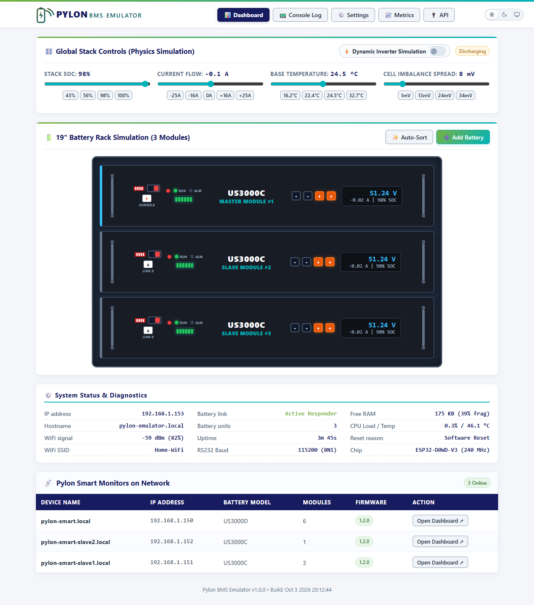
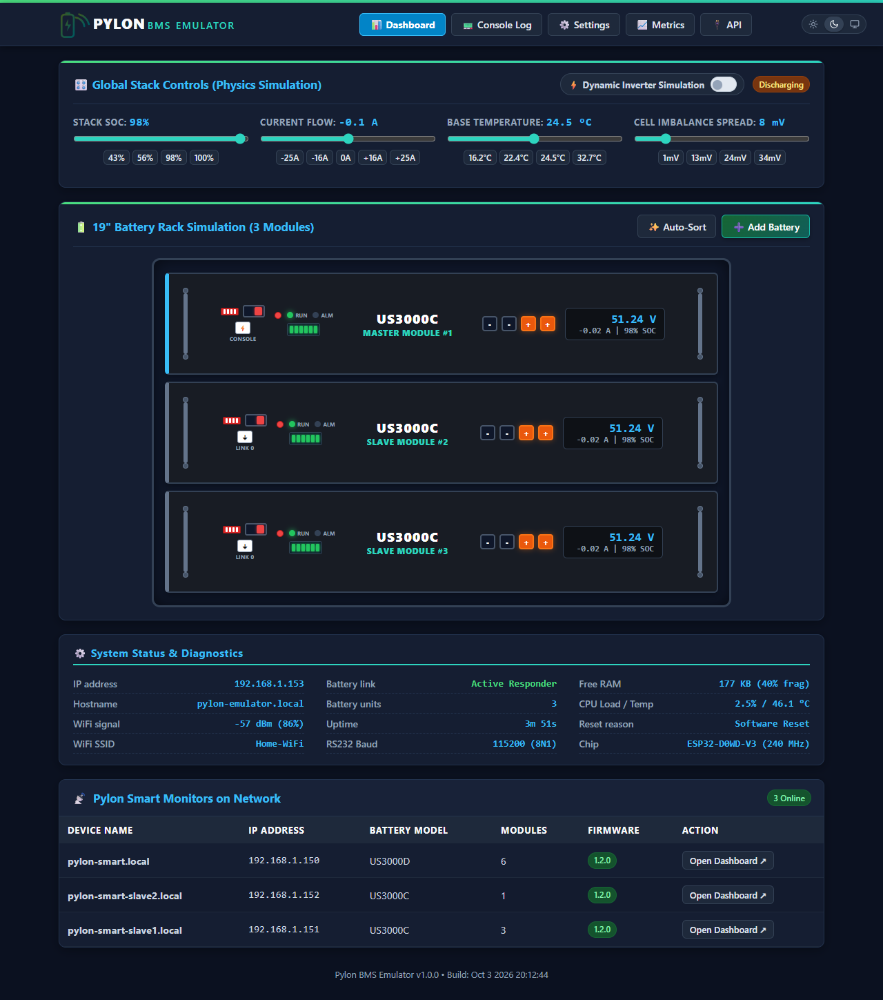

# WiFi-to-RS232 Pylon Smart Monitor

Hardware and firmware solution for monitoring Pylontech LiFePO4 battery stacks (**US3000C**, **US3000D**) via their RJ45 RS232 console port and exposing metrics over WiFi in **Prometheus format**, **Home Assistant MQTT**, and an interactive **Web Dashboard**.

---

## Features

- **Battery Support:** Tested with **US3000C** and **US3000D** modules (15-cell configuration).
- **Auto Model & Stack Detection:** Identifies battery model via `info` command and automatically detects Master stacks and active module count (up to 16 units) via `pwr`.
- **Intelligent Dual-Cadence Polling:**
  - **Fast Polling (default 60s):** Queries dynamic telemetry (`pwr` stack totals and `bat` per-cell voltages, temperatures, and balancing flags) in under 1 second.
  - **Slow Polling (default 300s):** Queries static/slow telemetry (`stat` cycle counts & alarms, `info` firmware & barcodes, `soh`/`euro` metrics).
  - Configurable directly from the Web UI (`/settings`).
- **Interactive Web Dashboard** with 24-Hour Canvas chart, 12-card analytics grid, modules table, and live system status.
- **19" Rack Battery Visualization** — cell bargraphs with dynamic thermal gradient and BMS alarm counters.
- **Time Synchronization & Timezones (NTP)** with 22 worldwide cities and automatic DST.
- **Network & Static IP Configuration** directly from the Web UI.
- **Home Assistant MQTT Integration** with Auto-Discovery, device isolation via MAC suffixes, and 3-decimal display precision for cell voltages.
- **REST JSON API** — live telemetry, historical time-series, and ESP32 system diagnostics.
- **Prometheus Exporter & Grafana Dashboard** — full battery and ESP32 system metrics at `/metrics` with a ready-to-import [Grafana dashboard](integrations/grafana/pylontech-smart-monitor-dashboard.json).
- **Security** — optional HTTP Basic Auth and Bearer Token for REST API.
- **Standalone AP Mode** — portable field diagnostics without a home network.
- **Live RS232 Console** — raw `TX >>` / `RX <<` log with quick command buttons.
- **mDNS Peer Discovery** — automatically discovers other Pylon Smart Monitors on the network with module counts and live links.
- **Over-The-Air (OTA) Updates** — browser upload or PlatformIO network OTA.
- **Hardware Status LEDs** — WiFi (`CONN`) and Serial (`SER`) activity indicators.

---

---

## Repository Structure

```
WiFi-to-RS232/
├── software/           # Pylon Smart Monitor firmware (ESP32) — Prometheus, MQTT, Web Dashboard
├── emulator/           # Pylon BMS Console Emulator firmware (ESP32) — Battery stack simulator
├── hardware/           # MAX3232 PCB hardware schematics, Gerber files, and 3D enclosures
├── integrations/       # Grafana dashboard templates and Home Assistant configs
└── docs/               # In-depth documentation (Hardware, UI, REST API, Prometheus)
```

---

## Projects Overview

### 1. Pylon Smart Monitor (`software/`)
Reads live telemetry from Pylontech battery stacks via the RJ45 RS232 console port and exposes it via:
* **Prometheus Metrics** (`/metrics`) with pre-built Grafana dashboards.
* **Home Assistant MQTT** with automatic discovery.
* **Interactive Web Dashboard** with real-time 24h charts, 19" rack visualization, and live cell voltages.
* **REST JSON API** for external automation scripts and monitoring systems.

### 2. Pylon BMS Console Emulator (`emulator/`)
A companion firmware that runs on the **exact same ESP32 + MAX3232 hardware board** to simulate a physical Pylontech battery rack (US2000C, US3000C, US3000D, US5000, UP5000) for development, testing, and CI/CD without needing a real battery:
* **Physics & Inverter Engine:** Realistic LiFePO4 OCV curves, cell voltage spread, thermal heating, and solar PV/inverter load simulation.
* **Master Hierarchy Validation:** Auto-enforces generation rank and firmware priority rules.
* **Fault & Alarm Injection:** Test over-voltage, under-voltage, over-current, and high-temp triggers.
* **Cross-over RJ45 Link:** Connect directly to the Smart Monitor via a standard RJ45 null-modem cable.

---

## Automated Unit Testing (Native C++)

Both projects include fast native C++ unit tests (Unity framework) that execute locally on your development machine in seconds:

```bash
# Run unit tests for Pylon Smart Monitor (Parser, Model Detection, Telemetry)
pio test -d software -e native

# Run unit tests for BMS Emulator (Physics, OCV Curve, Hierarchy, CLI Formatting)
pio test -d emulator -e native
```

---

## Web Interface

### 1. Pylon Smart Monitor Dashboard

| Light Theme | Dark Theme |
|:---:|:---:|
|  |  |

### 2. Pylon BMS Emulator Dashboard

| Light Theme | Dark Theme |
|:---:|:---:|
|  |  |

> [!TIP]
> Full web interface description with all screenshots (Module matrix, Console log, Settings): **[`docs/ui.md`](docs/ui.md)** and **[`emulator/README.md`](emulator/README.md)**

---

## Getting Started

### 1. Build and Flash Firmware

Prerequisites: [PlatformIO Core](https://platformio.org/).

**Pylon Smart Monitor:**
```bash
cd software
pio run -e wemos_d1_mini32 -t upload   # Wemos D1 Mini ESP32
# or: pio run -e lolin_s2_mini -t upload
# or: pio run -e esp32_c3_super_mini -t upload
```

**Pylon BMS Console Emulator:**
```bash
cd emulator
pio run -e wemos_d1_mini32 -t upload   # Wemos D1 Mini ESP32
# or: pio run -e lolin_s2_mini -t upload
# or: pio run -e esp32_c3_super_mini -t upload
```

To monitor debug serial output:
```bash
pio device monitor -b 115200
```

### 2. First Boot & WiFi Setup

1. Power on the device.
2. Connect to the open WiFi access point (**`Pylon-Smart-XXXX`** or **`Pylon-Emulator-XXXX`**).
3. The captive portal opens automatically (or navigate to `http://192.168.4.1/`).
4. Open `/settings`, select your SSID, enter password, and save.

### 3. Web Navigation

| URL | Description |
|:---|:---|
| `http://<device-ip>/` | Main Dashboard |
| `http://<device-ip>/module?m=N` | Module Rack Detail |
| `http://<device-ip>/log` | Live RS232 Console |
| `http://<device-ip>/settings` | Settings & Integrations |
| `http://<device-ip>/wifi` | WiFi Setup Portal |
| `http://<device-ip>/metrics` | Prometheus Metrics (Monitor) |
| `http://<device-ip>/api/data` | REST JSON API (live telemetry & diagnostics) |
| `http://<device-ip>/api/module` | REST JSON API (module detail) |
| `http://<device-ip>/api/status` | REST JSON API (micro polling/pause status) |
| `http://<device-ip>/api/history` | REST JSON API (24h telemetry samples) |
| `http://<device-ip>/api/peers` | REST JSON API (discovered peer monitors) |
| `http://<device-ip>/update` | OTA Firmware Update |
| `http://pylon-smart.local/` | mDNS hostname (or `http://pylon-emulator.local/`) |

---

## Documentation

| Document | Description |
|:---|:---|
| **[`software/README.md`](software/README.md)** | Smart Monitor firmware build, configuration, and OTA update guide |
| **[`emulator/README.md`](emulator/README.md)** | BMS Emulator architecture, physics engine, and simulation guide |
| **[`hardware/README.md`](hardware/README.md)** | PCB design, pinout, UART mapping, RS232 interface |
| **[`docs/ui.md`](docs/ui.md)** | Web interface guide with screenshots |
| **[`docs/api.md`](docs/api.md)** | REST API reference, endpoint schemas, integration examples |
| **[`docs/prometheus.md`](docs/prometheus.md)** | Prometheus metrics reference and Grafana PromQL recipes |
| **[`integrations/grafana/`](integrations/grafana/pylontech-smart-monitor-dashboard.json)** | Ready-to-import Grafana dashboard template for Prometheus |


---

## Disclaimer

> [!CAUTION]
> **Use at Your Own Risk:** This project, including all firmware, hardware schematics, PCB designs, documentation, and tools, is provided on an **"AS IS"** basis without warranty of any kind, either express or implied, including but not limited to the implied warranties of merchantability, fitness for a particular purpose, or non-infringement.
>
> In no event shall the authors, maintainers, or contributors be held liable for any direct, indirect, incidental, special, exemplary, punitive, or consequential damages (including, but not limited to, loss of data, loss of profits, equipment damage, battery degradation, electrical fires, property damage, or personal injury) arising in any way out of the use, modification, assembly, or installation of this hardware or software, even if advised of the possibility of such damage.
>
> Working with high-capacity lithium battery energy storage systems (LiFePO4) involves high electrical currents and inherent fire or shock hazards. You are solely responsible for verifying wiring, correct voltage polarity, proper fusing, and compliance with local electrical safety regulations before connecting any custom hardware to your battery or inverter.
>
> **Trademark Notice:** This is an independent open-source project and is not affiliated with, endorsed by, sponsored by, or associated with Pylon Technologies Co., Ltd. "Pylontech", "Pylon", and associated model designations are trademarks or registered trademarks of their respective holders.

---

## License

This project is licensed under the GNU General Public License v3.0 — see the [LICENSE](LICENSE) file for full details.
