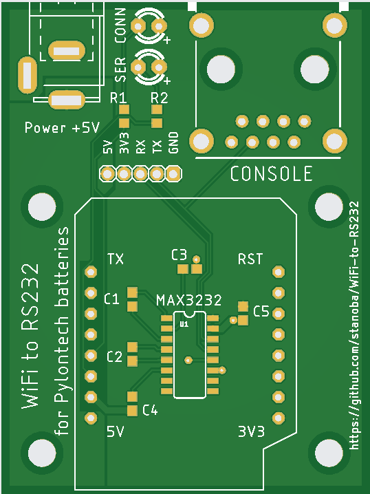
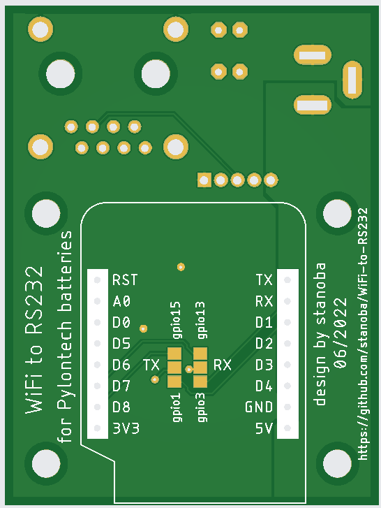

# WiFi-to-RS232 Hardware Shield

Custom hardware shield designed for the **Wemos D1 Mini (ESP32 / ESP8266)** form factor, interfacing directly with Pylontech LiFePO4 battery BMS console ports via standard RJ45 RS232.

---

## PCB Overview

| PCB Top View | PCB Bottom View |
|:---:|:---:|
|  |  |

---

## Key Hardware Features

- **Form Factor:** Compact shield mating with the outer 16 pins of standard Wemos D1 Mini / Wemos D1 Mini ESP32 boards.
- **RS232 Transceiver:** Maxim **MAX3232** (SOIC-16) with 5× 0.1 µF charge-pump capacitors, providing safe 3.3V-to-RS232 level shifting.
- **Console Interface:** Standard **RJ45 (8P8C)** modular jack matching Pylontech BMS console port pinout:
  - **Pin 3:** Pylontech TX (Console output $\rightarrow$ MAX3232 R1IN $\rightarrow$ ESP32 RX / GPIO23)
  - **Pin 6:** Pylontech RX (Console input $\leftarrow$ MAX3232 T1OUT $\leftarrow$ ESP32 TX / GPIO5)
  - **Pin 8:** Ground (GND)

> [!WARNING]
> **Never connect ESP32 GPIO pins directly to the Pylontech Console port!**
> The Pylontech Console port operates with standard RS232 levels ($\pm 12\text{ V}$). Connecting 3.3V microcontroller pins directly will destroy the ESP32. The onboard MAX3232 level shifter is required.
- **Status LEDs (Active-LOW with current-limiting resistors):**
  - **`CONN` LED (D3 / GPIO17):** WiFi connectivity status (solid ON when connected, blinking when searching or in AP setup mode).
  - **`SER` LED (D4 / GPIO16):** Serial port TX/RX pulse activity indicator.
- **Power Supply Options:**
  - 5V DC barrel jack input with decoupling capacitors, or
  - 5V input via Wemos D1 Mini USB port.
- **Configurable Solder Jumpers (Bottom Layer):**
  - SMD solder bridge pads allow routing TX and RX lines to alternate GPIOs if needed.
  - Default hardware configuration routes UART to **D8 (GPIO5)** for TX and **D7 (GPIO23)** for RX.

---

## Manufacturing & Gerber Files

The complete manufacturing package is provided in the repository:

- [`WemosSerial_2022-06-10.zip`](WemosSerial_2022-06-10.zip) – Contains standard RS-274X Gerber layers, Excellon NC drill files, and fabrication specs ready for PCB manufacturing (JLCPCB, PCBWay, etc.).
