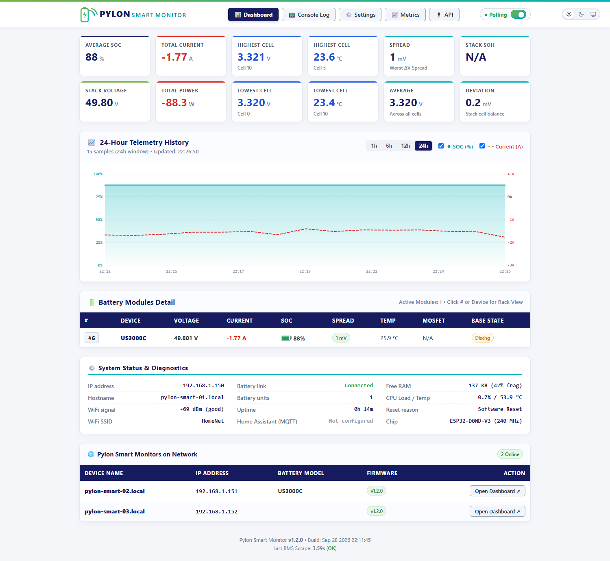
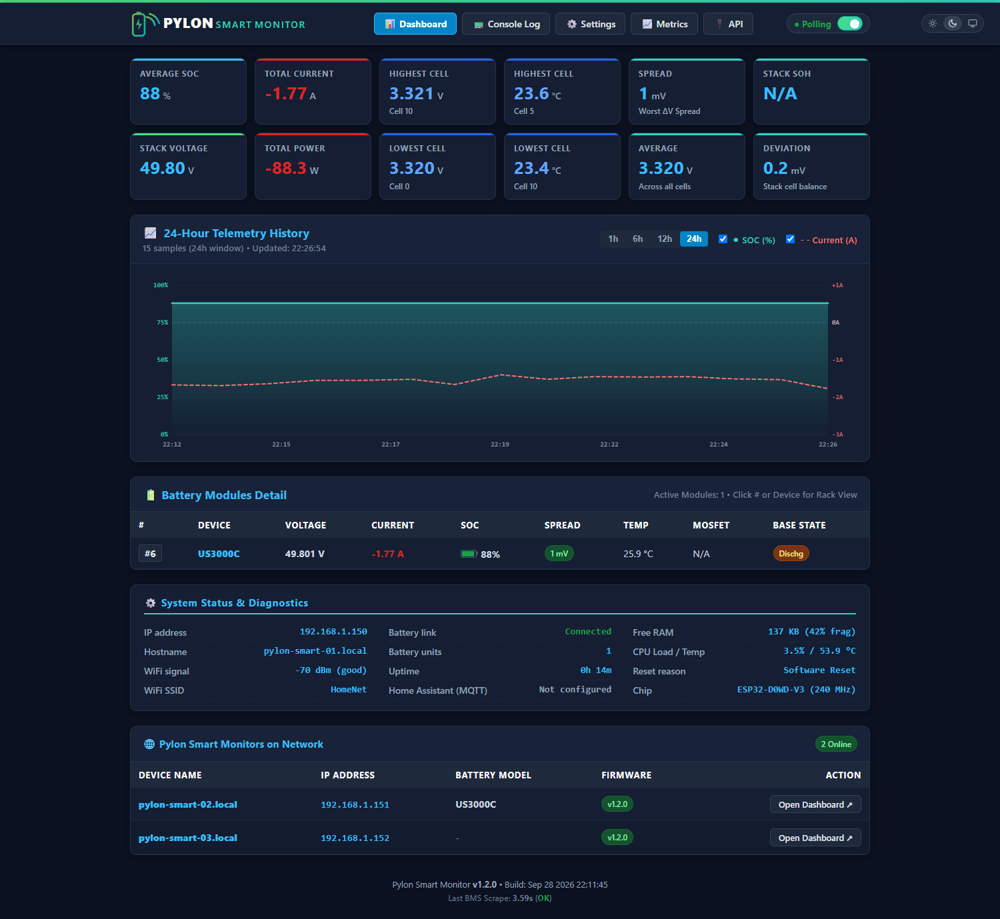
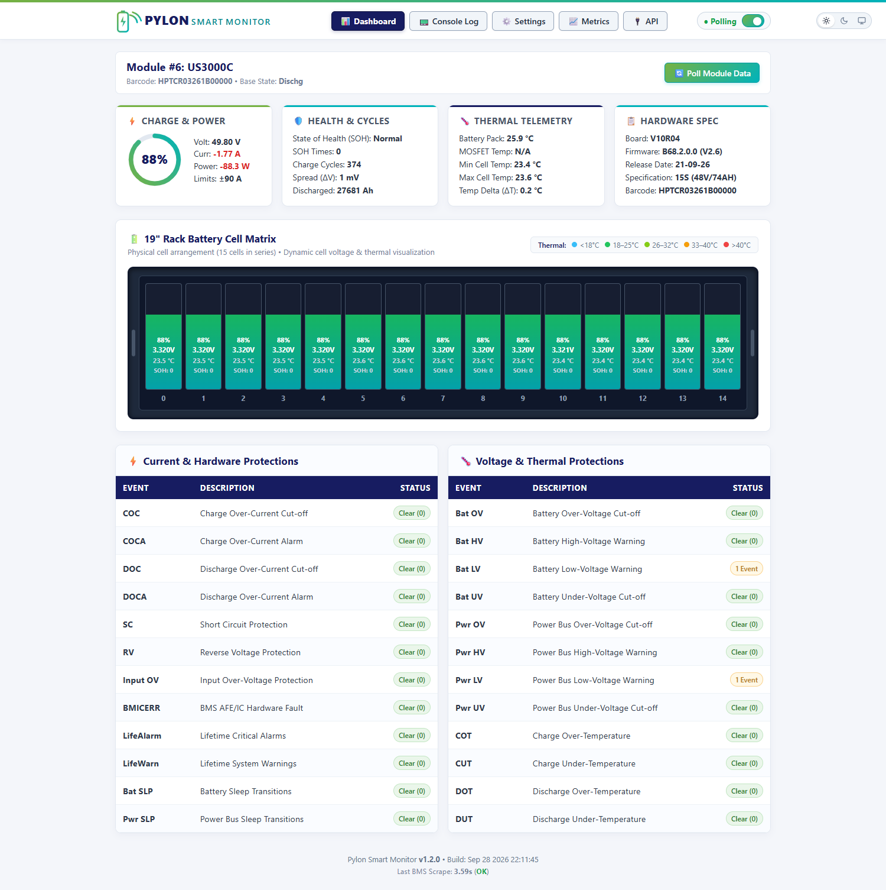
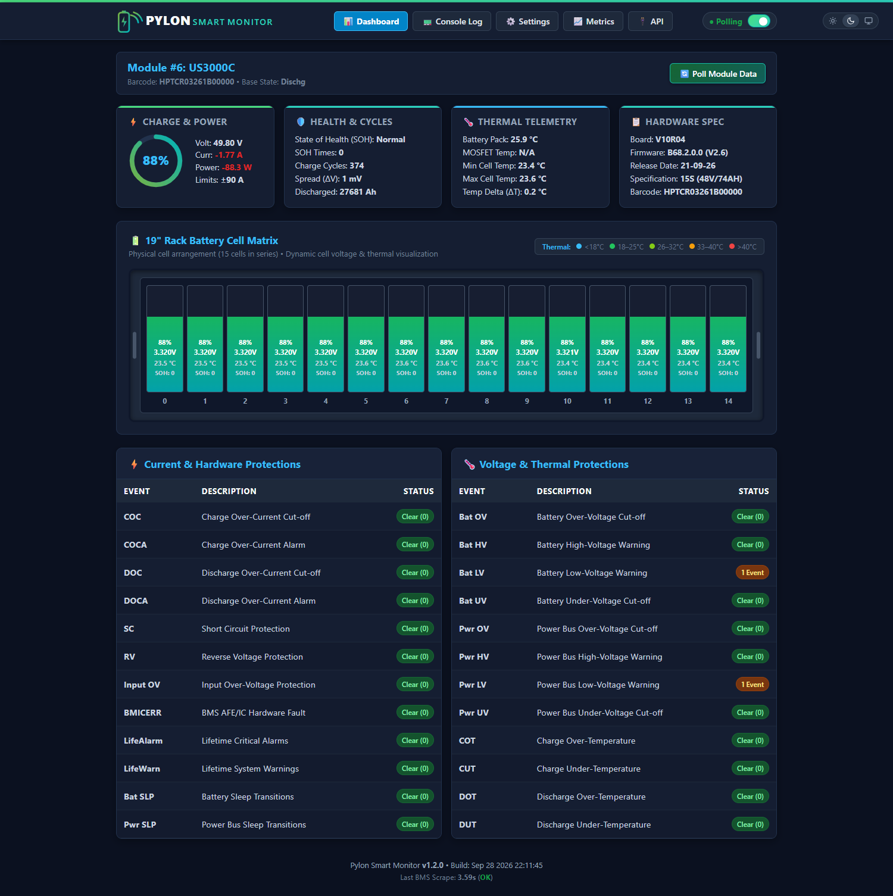
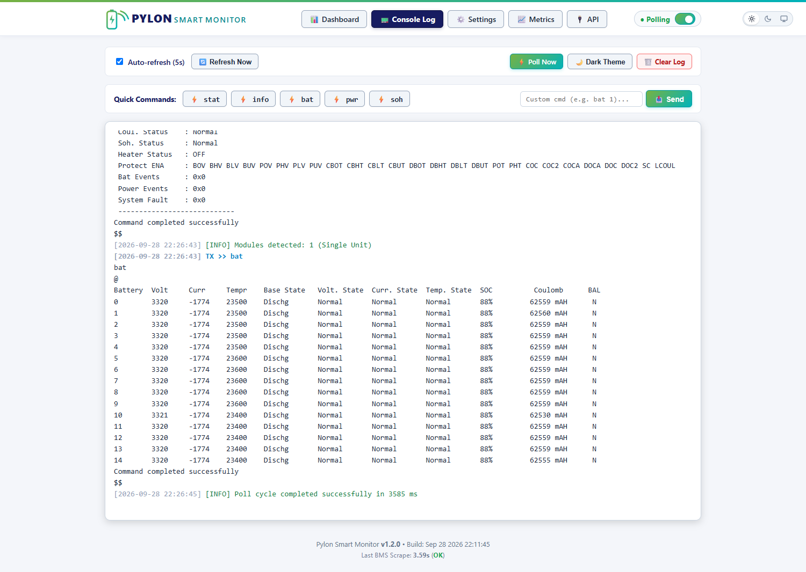
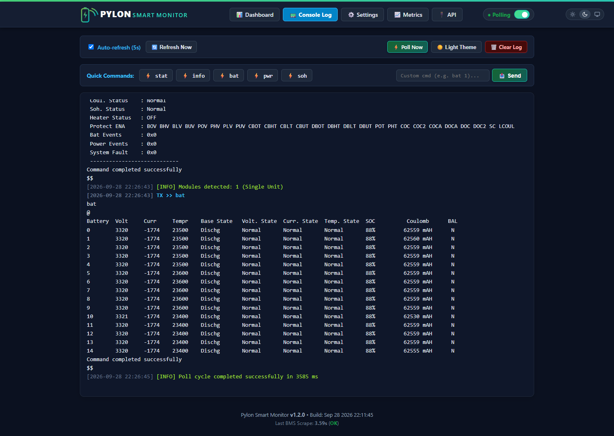
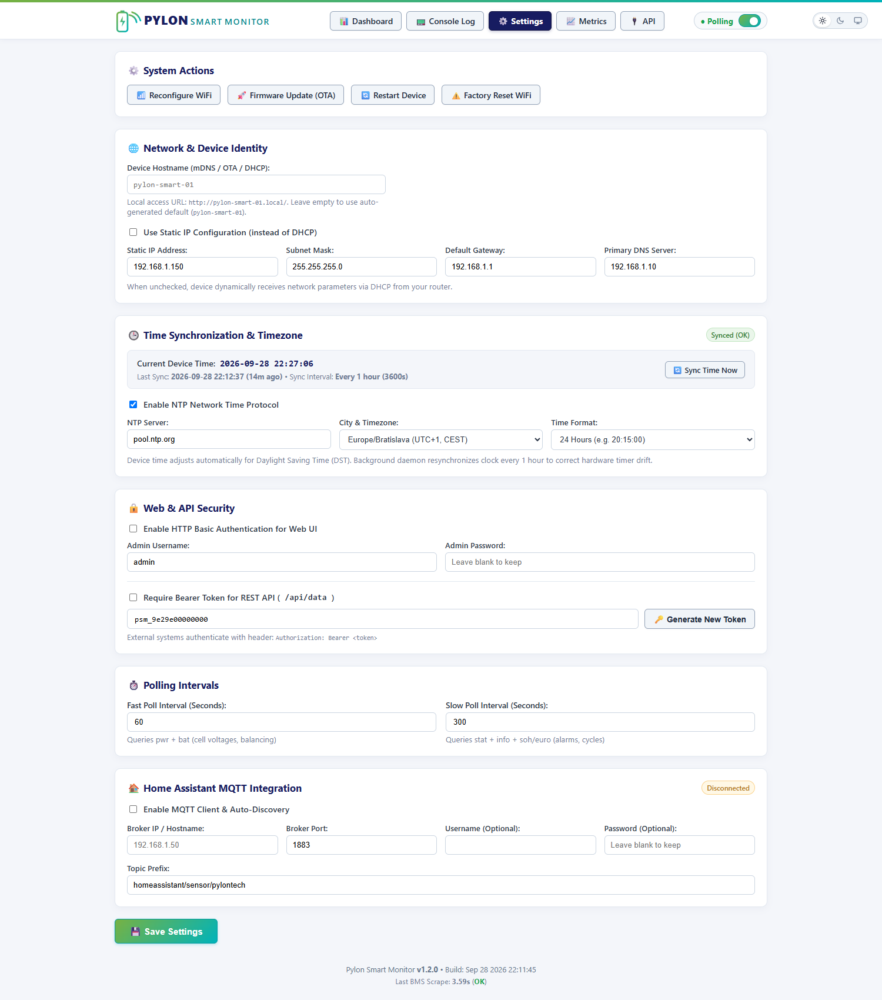
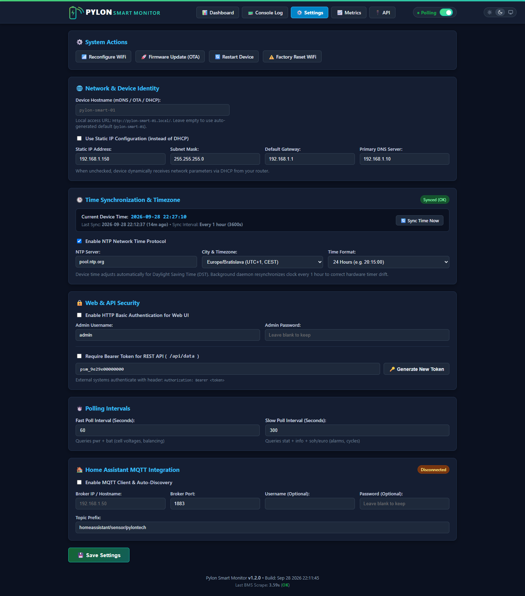

# WiFi-to-RS232 Firmware (ESP32)

Firmware for the **Wemos D1 Mini ESP32** / **LOLIN S2 Mini** development boards, designed to poll Pylontech battery stacks (**US3000C**, **US3000D**) via RS232 and expose metrics to Prometheus, Home Assistant MQTT, REST API, and an interactive Web Dashboard.

---

## Supported Boards

| Board | PlatformIO Env | Chip | Cores | Recommendation |
|:---|:---|:---|:---|:---|
| **Wemos D1 Mini ESP32** | `wemos_d1_mini32` | ESP32 | Dual-core 240 MHz | **Recommended** (Best stability) |
| LOLIN S2 Mini | `lolin_s2_mini` | ESP32-S2 | Single-core 240 MHz | Alternative (Native USB-C, PSRAM) |
| ESP32-C3 Super Mini | `esp32_c3_super_mini` | ESP32-C3 | Single-core RISC-V 160 MHz | Ultra-compact |

> [!TIP]
> **Recommended Board:** The **Wemos D1 Mini ESP32** is strongly recommended for production use. Because it features dual 240 MHz Xtensa cores, network protocols (WiFi, TCP/IP, WebPortal, Prometheus, mDNS) run smoothly on Core 0 while time-critical RS232 battery polling and serial queues run on Core 1 without resource competition.

---

## Key Configurations (`include/Config.h`)

All essential parameters can be adjusted in [`include/Config.h`](include/Config.h) or via the Web UI (`/settings`):

* **UART Configuration:**
  * **Wemos D1 Mini ESP32:** `TX = GPIO5` (D8), `RX = GPIO23` (D7) — Hardware UART2.
  * **LOLIN S2 Mini:** `TX = GPIO12`, `RX = GPIO11` — Hardware UART1.
  * **ESP32-C3 Super Mini:** `TX = GPIO4`, `RX = GPIO5` — Hardware UART1.
  * `SERIAL_BAUD_RATE = 115200`
  * `SERIAL_RX_BUFFER_SIZE = 2048` (Hardware RX ringbuffer to prevent dropping multi-cell responses).
* **LED Status Pins:**
  * **Wemos D1 Mini ESP32:** `PIN_LED_WIFI = 17` (D3), `PIN_LED_SERIAL = 16` (D4).
  * **LOLIN S2 Mini:** `PIN_LED_WIFI = 18`, `PIN_LED_SERIAL = 16`.
  * **ESP32-C3 Super Mini:** `PIN_LED_WIFI = 8`, `PIN_LED_SERIAL = 3`.
  * `LED_ACTIVE_LEVEL = LOW` (Active-LOW: VCC -> Resistor -> LED -> GPIO).
* **Dynamic PSRAM Allocation & Memory Optimization:**
  * Automatically detects external PSRAM (e.g. 2 MB on LOLIN S2 Mini) using `psramFound()`.
  * Allocates 64 KB rolling Console Log buffer and packed 24-hour Telemetry History buffer (`HistorySample`, 7 bytes/sample) directly in PSRAM.
  * Uses zero-heap HTTP chunked streaming (`ChunkedResponseSender`) for `/api/data`, `/api/module`, and `/api/history`, preventing OOM errors on low-heap chips.
* **mDNS Peer Discovery (`include/PeerDiscovery.h`):**
  * Announces monitor on the LAN as `_pylon-smart._tcp` with model and firmware version TXT records.
  * Background daemon discovers peer monitors on the local network, displayed on the Dashboard and exposed at `/api/peers`.
* **Dual-Cadence Polling & FIFO Queue:**
  * `FAST_POLL_INTERVAL_MS = 60000` (Fast poll: dynamic telemetry `pwr` and `bat`).
  * `SLOW_POLL_INTERVAL_MS = 300000` (Slow poll: static telemetry `stat`, `info`, `soh`/`euro`).
  * Polling intervals configurable dynamically from `/settings`.
  * Asynchronous FIFO queue (`userCmdQueue`) prevents collisions between console commands and scheduled polling.
* **24-Hour Telemetry History Ringbuffer:**
  * Rolling 24-hour circular buffer (`include/BatteryHistory.h`) with 1-minute samples (Current and SOC).
  * Powers the client-side HTML5 Canvas chart (`1h`, `6h`, `12h`, `24h` views) without external dependencies.
* **Time Synchronization & Timezones (`include/Timezones.h`):**
  * Multiple fallback servers: `pool.ntp.org`, `time.google.com`, `time.cloudflare.com`.
  * 22 selectable worldwide cities/timezones with automatic POSIX Daylight Saving Time (DST) rules.
  * Configurable 24-hour or 12-hour (AM/PM) time formatting.
  * Background daemon syncs every 1 hour to correct internal RTC oscillator drift.
* **Network & Static IP:**
  * Supports dynamic DHCP or user-defined Static IP, Subnet Mask, Gateway, and Primary/Secondary DNS (`8.8.8.8`).
* **Access Point & Standalone Mode:**
  * `AP_SSID_PREFIX = "Pylon-Smart"`
  * `AP_DEFAULT_PASSWORD = ""` (Open network, no password required).
  * Full dashboard accessible at `http://192.168.4.1/` with auto captive-portal redirection and automatic battery polling on client connection.
* **Integrations & Security:**
  * Home Assistant MQTT integration with Auto-Discovery.
  * Prometheus exporter at `/metrics` (see [`../docs/prometheus.md`](../docs/prometheus.md)).
  * REST API endpoints at `/api/data` and `/api/history` (see [`../docs/api.md`](../docs/api.md)).
  * Optional HTTP Basic Auth for Web UI and Bearer Token for REST API.

---

## System Diagnostics Module (`include/SystemStats.h`)

The firmware includes a built-in ESP32 diagnostics module that exposes live system health data:

| Metric | Description |
|:---|:---|
| CPU load % | Computed over 500 ms window via FreeRTOS Idle Hooks (both cores on ESP32) |
| CPU temperature | Via internal `temperatureRead()` sensor |
| Heap free / total / min / max | Live heap statistics with fragmentation % |
| PSRAM stats | If external PSRAM is present |
| WiFi RSSI / signal % | Measured signal strength and mapped quality percentage |
| WiFi SSID / BSSID / channel | Connected network details |
| IP / MAC address | Network identifiers |
| Chip model / revision / MHz | Hardware identification |
| Flash size / sketch size | Storage utilization |
| Reset reason | Last reboot cause (power-on, watchdog, software, etc.) |
| Uptime | Seconds since last boot |

These metrics are exposed via:
- **`/api/data`** — `"system": { ... }` JSON object in the API response.
- **`/metrics`** — `esp32_*` Prometheus metric family.
- **Web Dashboard** — Live 3-column System Status card (auto-refreshes BMS scrape status & uptime every 15 s).

---

## How to Compile & Flash

### 1. Requirements
* [PlatformIO Core (CLI)](https://docs.platformio.org/en/latest/core/index.html) or [VS Code PlatformIO IDE](https://platformio.org/install/ide?install=vscode).

### 2. Compile Firmware

**Wemos D1 Mini ESP32:**
```bash
pio run -e wemos_d1_mini32
# Binary: .pio/build/wemos_d1_mini32/firmware.bin
```

**LOLIN S2 Mini (ESP32-S2):**
```bash
pio run -e lolin_s2_mini
# Binary: .pio/build/lolin_s2_mini/firmware.bin
```

**ESP32-C3 Super Mini (RISC-V):**
```bash
pio run -e esp32_c3_super_mini
# Binary: .pio/build/esp32_c3_super_mini/firmware.bin
```

### 3. Initial USB Flash

**Wemos D1 Mini ESP32:**
```bash
pio run -e wemos_d1_mini32 -t upload
```

**LOLIN S2 Mini (ESP32-S2):**
```bash
# Enter bootloader: hold '0' button, press RST, release '0'
pio run -e lolin_s2_mini -t upload
```

**ESP32-C3 Super Mini:**
```bash
# Enter bootloader: hold 'BOOT' button, connect USB-C, release 'BOOT'
pio run -e esp32_c3_super_mini -t upload
```

To monitor debug serial output:
```bash
pio device monitor -b 115200
```

---

## Over-The-Air (OTA) Updates

Once the device is connected to your local WiFi, future firmware updates can be applied completely wirelessly.

### Method 1: Web Browser OTA
1. Open your browser and navigate to:
   ```
   http://<device-ip>/update
   # or
   http://pylon-smart.local/update
   ```
2. Click **Choose File** and select `.pio/build/wemos_d1_mini32/firmware.bin`.
3. Click **Flash Firmware**.
4. The board will upload, verify, flash, and reboot automatically within 10 seconds.

### Method 2: PlatformIO Network OTA (CLI)
You can flash directly from your terminal over WiFi, just like ESPHome:

```bash
# Upload via IP address:
pio run -t upload --upload-port 192.168.5.134

# Or upload via mDNS hostname:
pio run -t upload --upload-port pylon-smart.local
```

---

## Web Endpoints

* `/` – Main Dashboard (Stack summary, SOH, Volt Spread, MOSFET temp, modules table).
* `/module?m=N` – 19" Rack Battery Visualization with 15-cell bargraphs, dynamic thermal-to-turquoise gradient, on-demand refresh, and BMS alarm counters.
* `/log` – Live RS232 Console with raw `TX >>` / `RX <<`, quick buttons, and custom command input.
* `/settings` – Security, auth credentials, polling cadence, MQTT configuration, and system actions.
* `/metrics` – Prometheus exposition endpoint (see [`../docs/prometheus.md`](../docs/prometheus.md)).
* `/api/data` – REST JSON API endpoint (live stack, module, cell metrics, and system diagnostics; see [`../docs/api.md`](../docs/api.md)).
* `/api/module` – REST JSON API endpoint (detailed single-module telemetry; see [`../docs/api.md`](../docs/api.md)).
* `/api/history` – REST JSON API endpoint (historical telemetry samples; see [`../docs/api.md`](../docs/api.md)).
* `/api/peers` – REST JSON API endpoint (discovered Pylon Smart Monitors on the LAN; see [`../docs/api.md`](../docs/api.md)).
* `/wifi` – WiFi network scanner and connection configuration portal.
* `/sync_ntp` – Immediate trigger for NTP clock synchronization.
* `/update` – Browser-based OTA firmware upload.

---

## Web Interface

### Interactive Dashboard (`/`)

| Light Theme | Dark Theme |
|:---:|:---:|
|  |  |

### 19" Rack Battery Module Detail (`/module?m=N`)

| Light Theme | Dark Theme |
|:---:|:---:|
|  |  |

### Live Interactive RS232 Console (`/log`)

| Light Theme | Dark Theme |
|:---:|:---:|
|  |  |

### System Configuration & Settings (`/settings`)

| Light Theme | Dark Theme |
|:---:|:---:|
|  |  |

